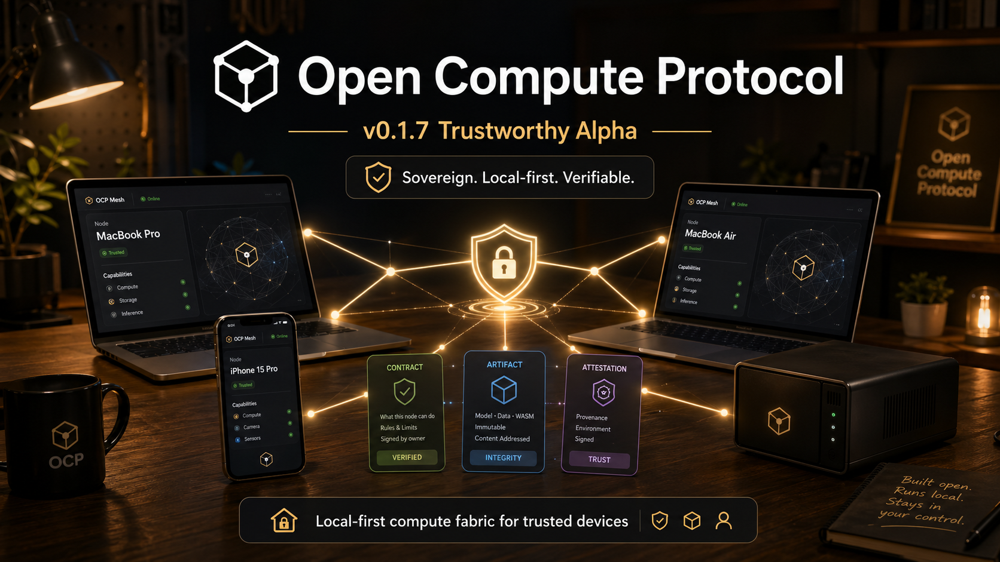
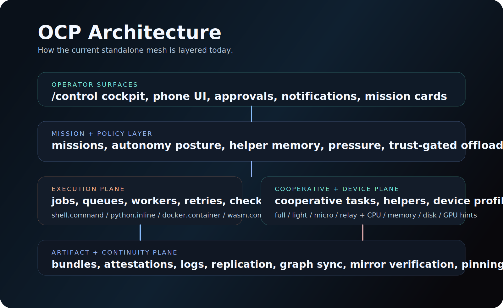
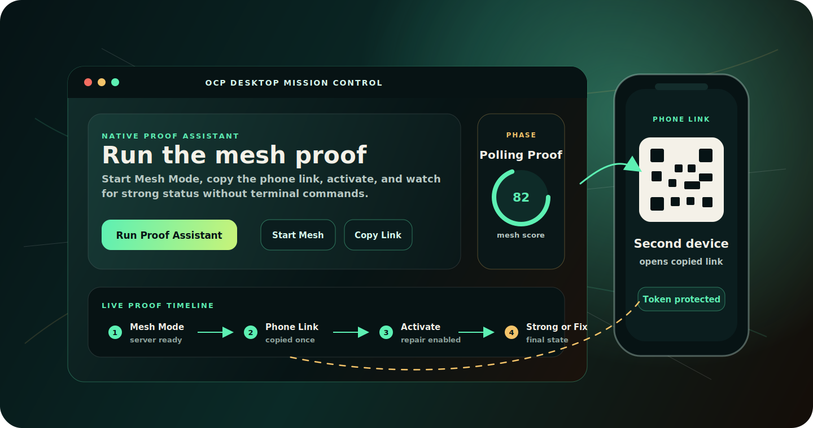

<p align="center">
  
</p>

<br/>

<div align="center">

# Open Compute Protocol

**A sovereign, local-first compute fabric for trusted devices.**

[](./tests/test_sovereign_mesh.py)
[](./README.md#current-status)
[](./docs/OCP_STATUS.md)
[](./docs/OCP_MASTER_PLAN.md)
[](./docs/OCP_STATUS.md)
[](./LICENSE)

</div>

<br/>

OCP is the layer that lets laptops, desktops, servers, GPU boxes, relays, and phones begin acting like **one practical distributed machine** without pretending to be one literal operating system.

<br/>

<p align="center">
  
</p>

<br/>

---

## The Problem

Most systems make you choose between:

- one machine, local control, limited power
- or someone else's cloud, unlimited power, zero control

**OCP is building the third option.**

A governed mesh of your own devices and trusted peers, where computation can move, artifacts can follow it, recovery can survive device failure, and your phone can still govern what the system is allowed to do.

---

## What It Does

When your workstation strains, the mesh notices. A helper laptop or GPU node is enlisted. The right workload shards move. Artifacts and checkpoints stay coherent. You remain in control from any device.

That is the difference between *scripts on a few boxes* and a real compute protocol.

<br/>

<details>
<summary><strong>Full capability list</strong></summary>

<br/>

**Identity & Peers**
- Signed peer identity and handshake
- Peer discovery, manifests, registry, and sync

**Execution**
- Worker registration, polling, claiming, and heartbeats
- Durable queued execution
- Shell, Python, Docker, and WASM execution lanes
- Resumable recovery with checkpoints, resume, restart, and audit trails

**Artifacts**
- Publishing, bundles, attestations, replication
- Graph replication, verification, and pinning

**Orchestration**
- Device profiles: `full` · `light` · `micro` · `relay`
- Compute profiles with CPU, memory, disk, GPU class, and VRAM hints
- Mesh pressure reporting
- GPU-aware cooperative task placement
- Trust-gated autonomous offload
- Durable offload preference memory

**Helper Lifecycle**
- Plan · Enlist · Drain · Retire · Auto-seek

**Operator Layer**
- Durable notifications and approvals
- Mission layer above jobs and cooperative tasks
- Mobile-friendly sovereign control deck
- Treaty-aware peer posture, custody hints, and operator summaries

</details>

---

## What Makes It Different

OCP does not treat machines as anonymous disposable capacity.

It treats them as **situated participants** in a trust-aware system.

| Other systems | OCP |
|---|---|
| Blunt autoscaling | Helper enlistment |
| Blind placement | Pressure-aware offload |
| Job retries | Mission continuity |
| Flat worker pool | Device classes |
| Desktop-only control | Phone / watch operator |

Some devices are powerful. Some are private. Some are fragile. Some are approval-only. Some should only be touched with permission. OCP knows the difference.

---

## Architecture

| Surface | Role |
|---|---|
| `mesh/sovereign.py` | Compatibility-preserving façade and orchestrator |
| `mesh_protocol/` | Signed envelopes, request IDs, handshake contracts, protocol errors |
| `mesh_state/` | SQLite-backed state helpers, projections, event and secret access |
| `mesh_scheduler/` | Placement, scoring, trust, backlog, helper, and GPU-aware selection |
| `mesh_execution/` | Runtime adapters, env and secret binding, submission, result packaging |
| `mesh_artifacts/` | Content-addressed artifacts, bundles, attestations, replication, pinning |
| `mesh_missions/` | Mission lifecycle, continuity, checkpoints, resume, and restart |
| `mesh_helpers/` | Helper lifecycle, offload preferences, autonomous helper evaluation |
| `mesh_governance/` | Notifications, approvals, and governance/policy helpers |
| `runtime.py` | Standalone SQLite-backed substrate |
| `server.py` | `/mesh/*` HTTP API, unified app shell, and operator UI routes |
| `server_app.py` | Installable app shell that unifies setup, control, and protocol inspection |
| `server_control_page.py` | Extracted control-deck renderer for the advanced operator surface |
| `server_http_handlers.py` | Grouped HTTP route handlers so `server.py` stays a thin transport host |
| `docs/` | Protocol notes, status, and roadmap |
| `tests/test_sovereign_mesh.py` | Regression suite — 189 tests |

**Key runtime concepts:**

- **Peers** — known remote nodes with trust and device profile state
- **Jobs** — normalized bounded execution units
- **Missions** — durable higher-level intent above jobs and cooperative tasks
- **Cooperative Tasks** — one logical task split across multiple peers
- **Artifacts** — bundles, checkpoints, logs, attestations, and replicated results
- **Helpers** — extra devices enlisted when the local node is under pressure
- **Treaty Advisories** — peer-level continuity, custody, and governance compatibility hints

---

## Prerequisites

- Python 3.11+
- Bash-compatible shell for `./scripts/start_ocp.sh`
- No external services required for the standalone local node flow

---

## Quick Start

```bash
git clone https://github.com/workingclassbuddha/open-compute-protocol.git
cd open-compute-protocol
python3 -m pip install -e .
python3 scripts/start_ocp_easy.py
```

Then open the OCP app:

```text
http://127.0.0.1:8421/
```

If the deck is empty on a fresh node, seed demo activity in a second terminal:

```bash
python3 scripts/seed_control_demo.py --base-url http://127.0.0.1:8421
```

If you want the direct server form instead of the helper script:

```bash
python3 server.py --host 127.0.0.1 --port 8421
```

If you want the shell-based starter instead of the auto-open launcher:

```bash
./scripts/start_ocp.sh
```

**Useful options:**

```text
--db-path         ./ocp.db
--identity-dir    ./.mesh
--workspace-root  .
--node-id         alpha-node
--display-name    "Alpha"
--device-class    full
--form-factor     workstation
```

For a fuller walkthrough, see [docs/QUICKSTART.md](./docs/QUICKSTART.md).

### Trustworthy Alpha Notes

OCP v0.1.7 is a stabilization pass around packaging, security posture, protocol contract visibility, tests, and demo flow. It is still alpha and should not be treated as production-secure or protocol-stable.

- [Security Model](./docs/SECURITY_MODEL.md)
- [Operator Authorization](./docs/OPERATOR_AUTH.md)
- [HTTP API Overview](./docs/OCP_HTTP_API.md)
- [Two Macs and a Phone Demo](./docs/DEMO_TWO_MACS_AND_PHONE.md)
- [v0.1 Draft Spec](./docs/spec/OCP_v0.1.md)

---

## OCP App

OCP ships a built-in one-app surface at `GET /` and `GET /app`. It is designed for phone browsers and can be added to the home screen as a local-first operator app.

Mac beta desktop launcher:

```bash
python3 -m ocp_desktop.launcher
```

The launcher keeps state under `~/Library/Application Support/OCP/`, can start a local-only node or LAN-reachable Mesh Mode node, opens the OCP app, and shows the phone link for testing on the same Wi-Fi.

Native SwiftPM Mac app:

```bash
swift run OCPDesktop
```

This native Mission Control shell uses the same OCP server, state paths, operator-token phone links, app-status polling, persisted app-history samples, charts, client-derived route topology, guided setup, and default-worker startup behavior as the Python launcher.

### Native Proof Assistant

The native Mac app now includes a one-click Proof Assistant for the two-device OCP proof. Launch the app, then click **Run Proof Assistant** from the Overview, Setup Doctor, toolbar, or Mesh menu.

<p align="center">
  
</p>

The assistant runs the no-terminal path end to end:

1. Generates and persists an operator token if needed.
2. Starts Mesh Mode when the server is not already running in mesh mode.
3. Waits for `/mesh/app/status` to become reachable.
4. Copies the tokened phone link once for the run and shows it in the app.
5. Calls the existing Autonomic Mesh activation flow with proof and repair enabled.
6. Polls status until setup becomes `strong`, OCP reports a proof issue, or the proof times out with a concrete next fix.
7. Records one app-history sample at the end so the Mission Control charts reflect the run.

No server routes or schemas are added for this flow. The native assistant only orchestrates the existing `/mesh/app/status`, `/mesh/app/history`, `/mesh/app/history/sample`, and `/mesh/autonomy/activate` endpoints. The individual Start Mesh, Copy Phone Link, Activate Mesh, and Open App controls remain available as secondary controls.

Unsigned macOS beta bundle:

```bash
python3 scripts/build_macos_app.py
open dist/OCP.app
```

Unsigned native SwiftPM beta bundle:

```bash
python3 scripts/build_swift_macos_app.py
open "dist/OCP Desktop.app"
```

The beta `.app` requires `python3` to be installed on the Mac. It excludes local state, identities, databases, `.git`, caches, and test artifacts from the bundle.

When Mesh Mode is started from the desktop launcher, copied phone links include an operator token in the URL fragment and the browser stores it locally for OCP POST actions. If you start the server manually with `OCP_HOST=0.0.0.0`, set `OCP_OPERATOR_TOKEN` and open `http://HOST_IP:8421/app#ocp_operator_token=YOUR_TOKEN` from the phone.

Inside the app:

- `Today` shows mesh strength, Autonomic Mesh status, latest proof, proof timeline, next actions, and a phone link/QR
- `Today` can ask the scheduler to choose the best device and can operator-mediate proof-artifact replication without storing remote tokens
- The native Mac app adds Mission Control pages for overview charts, guided setup, route topology, route health, execution readiness, artifact sync, protocol links, and settings
- `Setup` embeds the easy setup flow from `GET /easy`
- `Control` embeds the advanced control deck from `GET /control`
- `Protocol` links the live manifest, device profile, and HTTP contract from `/mesh/*`

The setup module is meant for the common human flow: open OCP on two or more machines, press `Connect Everything`, then press `Test Whole Mesh`.
It now also supports:

- `Copy My Easy Link` for manual fallback
- QR pairing so the second device can open the pairing link by scanning instead of typing
- automatic LAN/share URL detection in the easy page so the phone and spare laptop can see the best local address without manual IP hunting
- one-button nearby mesh join with `Connect Everything`
- one-button cooperative verification across the whole current mesh with `Test Whole Mesh`
- an auto-open starter script at `python3 scripts/start_ocp_easy.py`, which now also prints detected LAN URLs and advertises default worker readiness for full laptop/workstation nodes

The control module is phone-friendly, so your phone can act as a real operator console for the mesh. From there you can inspect and act on:

- Peer and helper state
- Queue and recovery status
- Approvals and notifications
- Cooperative tasks and missions
- Autonomy posture
- Offload memory
- Treaty/custody compatibility, restore-target hints, and live peer advisory events

For remote UI testing on a fresh standalone node, use:

```bash
python3 scripts/seed_control_demo.py --base-url http://HOST_IP:8421
```

---

## Visual Identity

This repo includes branded OCP graphics directly in source:

- `assets/ocp-hero.svg`
- `assets/ocp-architecture.svg`

These are meant to give the project a clearer identity as:

- a protocol
- a mesh
- a mission-oriented control layer
- a sovereign alternative to anonymous cloud orchestration

---

## Tests

```bash
python3 scripts/check_protocol_conformance.py
python3 -m unittest tests.test_sovereign_mesh
python3 server.py --help
```

Current baseline: **189 tests passing.**

---

## Current Status

**Released in v0.1.6**

- Protocol-first app hardening adds schemas for artifact replication auth, execution readiness, worker capacity, setup timeline events, and app/protocol status.
- Native Mission Control adds a SwiftUI sidebar app with charts and a persisted `/mesh/app/history` API for app-status samples.
- Private proof-artifact replication now supports explicit operator-mediated `remote_auth` and records only redacted audit metadata.
- `/mesh/app/status` now exposes protocol, execution-readiness, artifact-sync, and timeline projections so the app and launcher can explain the mesh without scraping UI state.
- Full laptop/workstation nodes started through the easy script or desktop launcher can auto-advertise a default worker so scheduler demos work out of the box.
- Autonomic Mesh alpha adds route health, one-button activation, proof repair, helper-safe enlistment, and app-visible summaries.
- Desktop Alpha RC adds a Mac beta launcher, unsigned `.app` bundle builder, and a polished `/app` Today surface backed by `GET /mesh/app/status`.
- LAN operator hardening now requires signed peer traffic or operator-token authenticated raw mesh mutations from non-loopback clients.
- Private artifact content fetches now require operator auth unless the artifact policy is public.
- Runtime execution now defaults to explicit environment inheritance, with `inherit_env_allowlist` for deliberate host env pass-through.
- The signed envelope implementation now uses dependency-free Ed25519 helpers under `ed25519-sha512-v1`.
- The protocol-kernel refactor and mission-continuity/treaty foundation from v0.1.3 remain intact, with the full regression suite green at 189 tests.

**Implemented in the current runtime**

- standalone local node startup
- peer identity, manifests, sync, and discovery
- queued jobs, missions, cooperative tasks, and recovery controls
- helper enlistment, mesh pressure, and operator approvals
- built-in `/` app shell with `/easy` setup and `/control` operator modules
- treaty-aware continuity advisories across peer cards, mission summaries, connect/sync responses, and live streams
- code-owned `/mesh/contract` route map, schema registry, and validation helpers for protocol and conformance work

**Still evolving**

- richer treaty and custody enforcement beyond the current advisory and continuity-specific layer
- continuity-vessel and richer artifact lineage work
- broader multi-device orchestration UX

---

## Current Framing

- `OCP v0.1` — protocol and spec draft
- `v0.1.6` — current implementation release
- `Sovereign Mesh` — Python-first reference implementation
- `sovereign-mesh/v1` — current wire version

---

## Direction

The strongest near-term directions:

1. Richer mission-centric operator UX
2. Stronger policy and treaty semantics for peer cooperation
3. Continuity-vessel evolution of checkpoints and recovery
4. More expressive helper and GPU orchestration
5. A more cinematic, legible constellation-style cockpit

OCP is already past "protocol sketch" stage. If it keeps going in this direction, it becomes more than a scheduler. It becomes a practical sovereign compute layer for all your devices.

---

## Related

- [Status](./docs/OCP_STATUS.md)
- [v0.1.6 Release Notes](./docs/RELEASE_v0.1.6.md)
- [7026 Vision](./docs/OCP_7026_VISION.md)
- [Quickstart](./docs/QUICKSTART.md)
- [Master Plan](./docs/OCP_MASTER_PLAN.md)
- [All Devices Plan](./docs/OCP_ALL_DEVICES_PLAN.md)

---

## Boundary

OCP is standalone. It can integrate with other systems but is not a submodule of any of them and should not be described as one.

---

<div align="center">
<br/>
<sub>sovereign · local-first · trust-aware · all your devices</sub>
</div>
